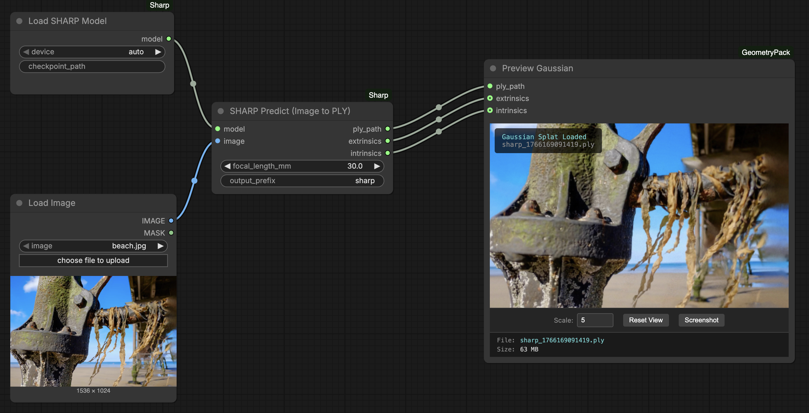
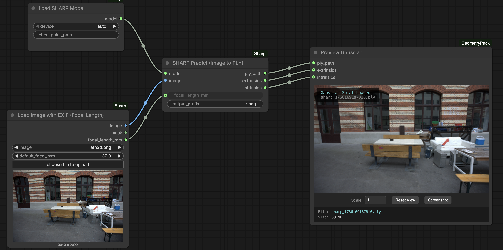

# ComfyUI-Sharp

<div align="center">
<a href="https://pozzettiandrea.github.io/ComfyUI-Sharp/">

</a>
<br>
<b><a href="https://pozzettiandrea.github.io/ComfyUI-Sharp/">View Live Test Gallery →</a></b>
</div>

ComfyUI wrapper for [SHARP](https://arxiv.org/abs/2512.10685) by [Apple](https://github.com/apple/ml-sharp) - monocular 3D Gaussian Splatting in under 1 second.

2 Example workflows.

Workflow 1: standard/user input focal length.



https://github.com/user-attachments/assets/479fb066-4d40-4d7c-a8d4-d1224fc22efa


Workflow 2: focal length extraction from exif data.




https://github.com/user-attachments/assets/b0c3e196-aa93-4380-8f8b-9c19b833b818

Note: for PLY inference this model is good on its own, but for the Gaussian Viewer node, you're going to need to install this node as well! https://github.com/PozzettiAndrea/ComfyUI-GeometryPack

Model auto-downloads on first run. For offline use, place `sharp_2572gikvuh.pt` in `ComfyUI/models/sharp/`.

## Nodes

- **Load SHARP Model** - (down)Load the SHARP model
- **SHARP Predict** - Generate 3D Gaussians from a single image
- **Load Image with EXIF** - Load image and auto-extract focal length from EXIF (35mm equivalent)

Images with EXIF data get focal length auto-calculated when using the Load Image with EXIF node.

## Community

Questions or feature requests? Open a [Discussion](https://github.com/PozzettiAndrea/ComfyUI-Sharp/discussions) on GitHub.

Join the [Comfy3D Discord](https://discord.gg/bcdQCUjnHE) for help, updates, and chat about 3D workflows in ComfyUI.

## Setup Instructions

### A) Using ComfyUI Manager (Recommended)
This package is available in the [ComfyUI Manager](https://docs.comfy.org/manager/install).

### B) Manual Installation
These instructsions assume you have the portable version of ComfyUI, but you can just replace the Python path otherwise.

```powershell
cd ComfyUI/custom_nodes
git clone https://github.com/PozzettiAndrea/ComfyUI-Sharp
cd ComfyUI-Sharp
..\..\embeded_python\python.exe -m pip install -r requirements.txt
..\..\embeded_python\python.exe install.py
```

## Credits

Thanks to Apple for releasing SHARP as open source.
